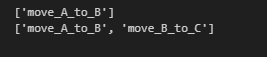

# ExpNo:10 Implementation of Classical Planning Algorithm
# Algorithm or Steps Involved:
<ol>
  <li>Define the initial state</li>
  <li>Define the goal state</li>
  <li>Define the actions</li>
  <li>Find a <b>plan</b> to reach the goal state</li>
  <li>Print the plan</li>
</ol>

# Example - 1
```
initial_state = {'A': 'Table', 'B': 'Table'}
goal_state = {'A': 'B', 'B': 'Table'}

actions = {
    'move_A_to_B': {'precondition': {'A': 'Table', 'B': 'Table'}, 'effect': {'A': 'B'}},
    'move_B_to_Table': {'precondition': {'A': 'Table', 'B': 'B'}, 'effect': {'B': 'Table'}}
}

plan = find_plan(initial_state, goal_state, actions)
print(plan)
```
# Output:
```
['move_A_to_B']
```
# Example - 2
```
initial_state = {'A': 'Table', 'B': 'Table', 'C': 'Table'}
goal_state = {'A': 'B', 'B': 'C', 'C': 'Table'}

actions = {
    'move_A_to_B': {'precondition': {'A': 'Table', 'B': 'Table'}, 'effect': {'A': 'B'}},
    'move_B_to_C': {'precondition': {'A': 'B', 'B': 'Table', 'C': 'Table'}, 'effect': {'B': 'C'}},
    'move_C_to_Table': {'precondition': {'A': 'B', 'B': 'C', 'C': 'C'}, 'effect': {'C': 'Table'}}
}

plan = find_plan(initial_state, goal_state, actions)
print(plan)
```
# Output:
```
['move_A_to_B', 'move_B_to_C']
```

# Please Prepare Solution or Definition For the method find_plan(initial_state, goal_state, actions)
<h3>You Can use any of the searching Strategies for planning and executing a sequence of actions.<br> You can also look in to the Code given in the Repository.</h3>

## PROGRAM :

```PY
def is_goal_state(current_state, goal_state):
    return all(current_state.get(k) == v for k, v in goal_state.items())


def apply_action(current_state, action_effect):
    new_state = current_state.copy()
    new_state.update(action_effect)
    return new_state


def is_applicable(current_state, precondition):
    return all(current_state.get(key) == value for key, value in precondition.items())


def find_plan(initial_state, goal_state, actions):
    queue = [(initial_state, [])]
    visited_states = set()

    while queue:
        current_state, plan = queue.pop(0)

        if is_goal_state(current_state, goal_state):
            return plan

        state_tuple = tuple(sorted(current_state.items()))
        if state_tuple in visited_states:
            continue

        visited_states.add(state_tuple)

        for action in actions:
            if is_applicable(current_state, actions[action]['precondition']):
                next_state = apply_action(current_state, actions[action]['effect'])
                queue.append((next_state, plan + [action]))

    return None


# Example 1 → Output: ['move_A_to_B']
initial_state1 = {'A': 'Table', 'B': 'Table'}
goal_state1 = {'A': 'B', 'B': 'Table'}

actions1 = {
    'move_A_to_B': {
        'precondition': {'A': 'Table', 'B': 'Table'},
        'effect': {'A': 'B'}
    }
}

print(find_plan(initial_state1, goal_state1, actions1))


# Example 2 → Output: ['move_A_to_B', 'move_B_to_C']
initial_state2 = {'A': 'Table', 'B': 'Table', 'C': 'Table'}
goal_state2 = {'A': 'B', 'B': 'C', 'C': 'Table'}

actions2 = {
    'move_A_to_B': {
        'precondition': {'A': 'Table', 'B': 'Table'},
        'effect': {'A': 'B'}
    },
    'move_B_to_C': {
        'precondition': {'A': 'B', 'B': 'Table', 'C': 'Table'},
        'effect': {'B': 'C'}
    }
}

print(find_plan(initial_state2, goal_state2, actions2))
```

## OUPTUT :


## RESULT :

Thus, the program to implement Classical Planning Algorithm has been executed successfully.
